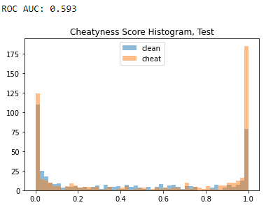

# DeepAimDetector

### Introduction
We classify individual bullets impacts as assisted by an aimbot or not.
These are highly preliminary results.

### Implementation Overview
Data is pasrsed from 64 hz SourceTV demos, sampled at 32 hz.  
Primary features are view anlge deltas, and the relative angular position of targets.
The model is a vanilla LSTM-512.  
Training data:  
- ~15,000 data points
- All generated by me
- All cheat samples from one commercial "legit" aimbot
- All kills using ak-47 on bots in deathmatch

### Results
Test accuracy on data from a different player using the same cheat:  

### TODO
- More feature engineering
- Model other cheats
- Get cheat samples from real games
- Benchmark human detection ability

### Long-term Goals
- Self-/semi-supervision
- Scale
